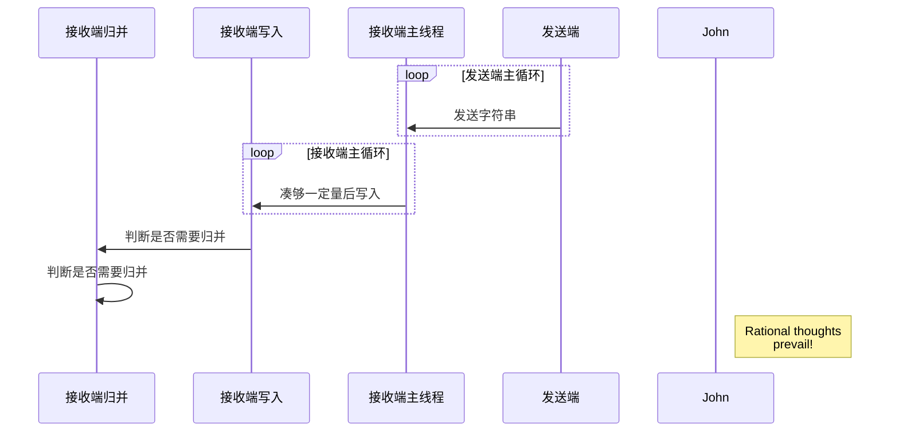

# 基于 Java 与 ZeroMQ 的分布式排序系统

数学三班 第二组

## 问题分析

假设每台机的传输带宽为 1000Mbps（全双工），恰好输出并输入了 40G 的数据，则这一过程将会耗费 320s。与之相比，XXXX

## 技术选型

Java vs. Python：Python 有全局解释器锁（GIL），难以实现多线程处理，内置的异步系统不够透明；Java 的异步写入可以通过线程池自行实现。

Java Socket vs. Netty vs. ZeroMQ：Java 自带的 Socket 无溢出保护；Netty 有异步但晦涩难懂，且瓶颈显然在传输上而不是在接收上；ZeroMQ 的 API 足够简洁且性能开销很小。

先传后排 vs. 先排后传：先传后排可利用传输的时间进行排序。

## 代码流程解析

```java
try (ZContext context = new ZContext()) { //...
int port = 5555;

ArrayList<Combo> sinks = new ArrayList<>(26);
for (int i = 0; i < 26; i++) {
    LOG.info("Creating sink for topic {}", (char) ('a' + i));
    sinks.add(new Combo((byte) ('a' + i), CAPACITY));
}

Socket socket = context.createSocket(SocketType.PULL);
socket.bind("tcp://*:" + port);

LOG.info("Ready for PUSH! Port: {}", port);

ThreadPoolExecutor executor = new ThreadPoolExecutor(8, 16,
        0L, TimeUnit.MILLISECONDS,
        new LinkedBlockingQueue<>());

ByteBuffer buffer = ByteBuffer.allocate(15);
```

初始化内存、Socket，分配解析字符串用的缓冲区

```java
while (!Thread.currentThread().isInterrupted()) {
    if (socket.recvByteBuffer(buffer, 0) < 1) {
        LOG.info("Received empty string!");
        break;
    }
    buffer.flip();
    CompressedString compressed = CompressedString.fromStringBuffer(buffer);
    buffer.clear();

    int catIndex = compressed.getCategoryIndex();
    Combo combo = sinks.get(catIndex);
    combo.sink.add(compressed);
    if (combo.sink.size() == CAPACITY) {
        ArrayList<CompressedString> oldSink = combo.sink;
        combo.sink = new ArrayList<>(CAPACITY);
        CompletableFuture.supplyAsync(PersistedFile.persist(combo.counter, oldSink), executor)
                .thenAcceptAsync(fileCreated(compressed.getCategory(), combo.queue, combo.counter, executor));
    }
}
```

循环接受信息，写入内存，并检测是否已满，已满则启动异步排序写入。

```java
CompletableFuture.supplyAsync(PersistedFile.persist(combo.counter, oldSink), executor)
        .thenAcceptAsync(fileCreated(compressed.getCategory(), combo.queue, combo.counter, executor));

/* ... */

private static Consumer<PersistedFile> fileCreated(byte cat, Set<PersistedFile> q, AtomicLong counter, Executor ex) {
    return file -> {
        Optional<PersistedFile> best = q.stream().filter(b -> b.getLevel() == file.getLevel()).findFirst();
        if (!best.isPresent())
            best = q.stream().filter(levelInRange(file)).findFirst();
        if (!best.isPresent()) {
            q.add(file);
        } else {
            PersistedFile b = best.get();
            q.remove(b);
            CompletableFuture.supplyAsync(() -> PersistedFile.merge(cat, file, b, counter), ex)
                    .thenAcceptAsync(fileCreated(cat, q, counter, ex));
        }
    };
}
```

写入完成后触发检测事件，判断是否有大小相近的文件，有则进行合并，合并后再次触发检测事件。

```java
socket.close();
LOG.info("Waiting for thread pool to empty...");
while (executor.getQueue().size() != 0 && executor.getActiveCount() != 0) {
    LOG.info("Still waiting...({} waiting, {} running)",
            executor.getQueue().size(), executor.getActiveCount());
    Thread.sleep(500);
}
executor.shutdown();
while (!executor.awaitTermination(1, TimeUnit.SECONDS)) {
    LOG.info("Waiting for final termination...");
}
```

等待线程池完全关停。

```java
ExecutorService tmpExecutor = Executors.newSingleThreadExecutor();
LOG.info("Cleaning unwritten strings...");
sinks.stream().filter(c -> !c.sink.isEmpty())
        .map(c -> CompletableFuture.supplyAsync(PersistedFile.persist(c.counter, c.sink), tmpExecutor)
                .thenAcceptAsync(fileCreated(c.category, c.queue, c.counter, tmpExecutor)))
        .collect(Collectors.toSet()).forEach(CompletableFuture::join);
tmpExecutor.shutdown();
```

将内存中仍未写入硬盘的字符串列表，全部同步写入硬盘。

```java
LOG.warn("Force merging files...");
Path result = Paths.get("C:\\Users\\Shiroki\\Code\\MRSort\\sorted\\result");
if (!Files.isDirectory(result)) {
    LOG.info("Result directory not existing, creating.");
    Files.createDirectory(result);
}
sinks.forEach(c -> c.queue.stream().reduce((a, b) -> PersistedFile.merge(c.category, a, b, c.counter))
        .ifPresent(last -> {
            LOG.info("String started with {} merged into {}, now decompressing.", (char) c.category, last.getPath().getFileName());
            Path target = result.resolve("result" + (char) c.category + ".txt");
            try {
                last.decompress(target);
                LOG.info("Decompressed to {}.", target.getFileName());
            } catch (IOException e) {
                LOG.error("Failed to decompress {}: {}", target.getFileName(), e);
            }
        }));
LOG.info("Merge finished.");
```

强制合并未合并的文件，最后解压缩为目标的结果格式。


